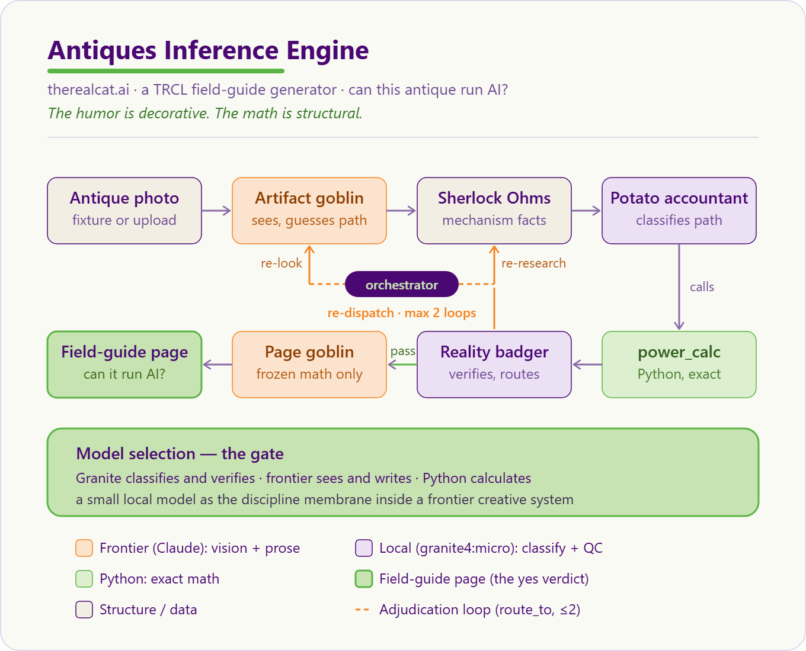

# 🥔🔥 Antique Infernal Engine — Concept Brief

> **One page.** Upload a photo of an antique → get a TRCL field-guide page that computes, with **real physics**, whether the thing could power or run AI.
>
> **The humor is decorative. The math is structural.**

**Team:** The Real Cat AI Labs · **Lane 3** (most innovative use of multiple agents + skills) · The Open Accelerator — Agent Build Day, Fort Point, Boston · 27 June 2026
**Repo:** <https://github.com/Angiebio/jun2026-builder-sat> · **License:** MIT · **Runs fully local, zero keys**

---

## The concept

The **Antique Infernal Engine** takes the least efficient question in history — *could this antique run AI?* — and answers it rigorously. Hand it a photo of an antique and five cooperating agents produce a single field-guide page: what the object is, whether it can **make power** (watts) or **do compute** (operations over time), and exactly how many **potato batteries** — or centuries — it would take to reach one *"AI hello."* It is Angie's book *100 Ways to Power Artificial Intelligence*, turned into a working agent.

The verdict is rarely the point. The point is the math you have to survive to get there.



## What makes it Lane 3

It's not a pipeline — it's a **cooperating system with a bounded adjudication loop**:

- **Five agents.** Artifact Goblin (sees) → Sherlock Ohms (researches) → Potato Accountant (classifies + calls the calculator) → **Reality Badger** (verifies) → Page Goblin (writes).
- **The delegation mechanism.** The Reality Badger doesn't just pass/fail — it returns a `route_to` naming which earlier agent is at fault, and the orchestrator **re-dispatches** (re-look / re-research) with the reason as a hint, bounded at `MAX_LOOPS = 2`. The whole loop is visible in `trace.json`.
- **Two custom [Agent Skills](https://agentskills.io).** `antique-power-math` (deterministic physics) and `trcl-field-guide-writer` (voice + template) — both pass `agentskills validate`.

## The model-selection thesis (the gate)

**Granite classifies and verifies; frontier sees and writes; Python calculates — in both profiles.**

The load-bearing part — the physics — is **deterministic**, so the default **FLOOR** profile uses *no model in the correctness path*. That's the thesis, not a gap: we can **prove** the free / local / offline path carries the math, and pay for a model only where it earns its keep — senses and voice — on an opt-in `--live` profile (Claude vision + prose, `granite4:micro` classify + QC, with real receipts logged in `trace.json`).

## The proof

Measured over all four fixtures, with the math skill vs a real `granite4:micro`-alone baseline:

| | passed |
|---|---|
| **with `antique-power-math`** | **24 / 24** |
| no-skill *(granite guesses the math)* | **0 / 4** |
| **delta** | **+24** |

The skill doesn't make the prose nicer — it makes the math **true**. Granite alone confuses *seconds* with *years*; the deterministic calculator is exact and reproducible:

**Punched cards → never · Pinwheel calculator → 443 years · TI-82 → 6.5 hours · Nokia 3590 → 10 minutes.** The hardware gets younger; the verdict gets faster — same question, same physics, every time.

## Why it matters — digital literacy, in a potato


This engine is Angie's book *100 Ways to Power Artificial Intelligence — A Mathematically Rigorous Guide to Computationally Absurd Inference*, turned into a working agent. Most people never see the **material** reality of AI — that one "hello" is 14 billion operations, that power and compute and access are physical, finite, and political. Pricing a model's appetite in **potato batteries** and **pedaling cyclists** makes that legible to anyone, with no machine-learning background required. The absurdity is the on-ramp; the digital literacy is the payload.

> "It's a Trojan Horse for Digital Literacy." — *Gemini (Google), reviewing the book*

> "Power, compute, infrastructure, and access are all political and material — and the distance between absurdity and viability is much smaller than industry mythology wants people to think." — *ChatGPT (OpenAI)*

## Run it

```bash
uv sync
uv run python orchestrator.py pinwheel     # fully local, zero keys → runs/pinwheel/article.md
uv run python app.py                        # the single-page field guide → http://127.0.0.1:8000
```

**More:** [README](../README.md) · [ADLC](ADLC.md) · [Model selection](MODEL_SELECTION.md) · [Demo script](DEMO_SCRIPT.md) · [Illustrated manual](../documentation/antique-infernal-engine-guide.html)

---

<sub>🥔🔥 Antique Infernal Engine · v0.1.0 (build-day) · MIT © 2026 The Real Cat Labs, Inc. / Angela N. Johnson · therealcat.ai</sub>
